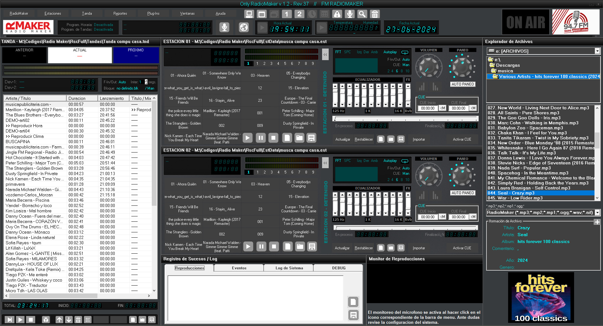
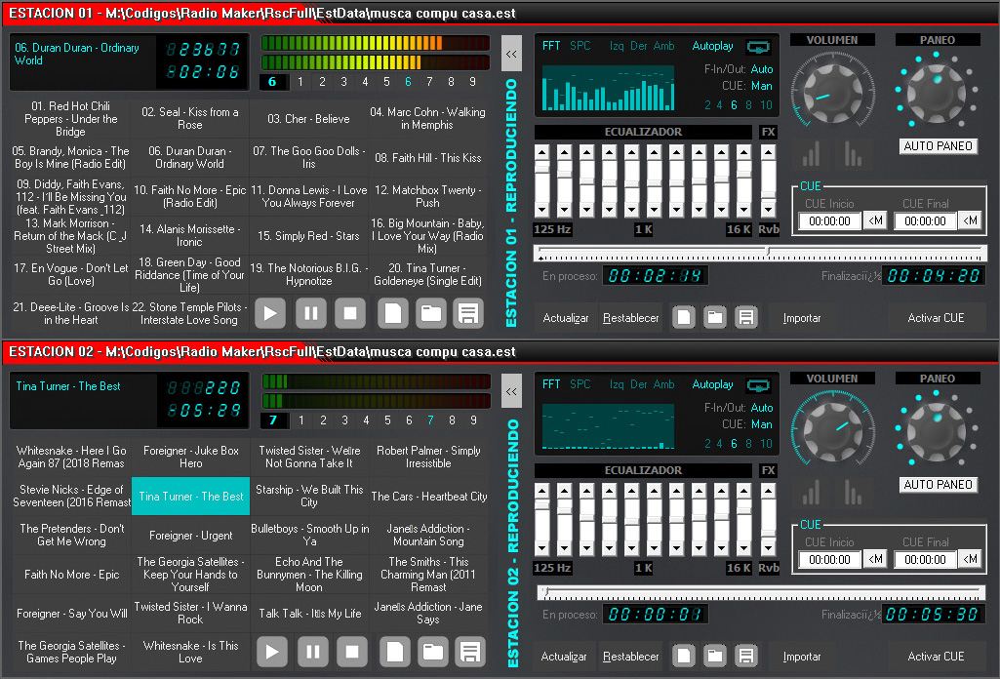
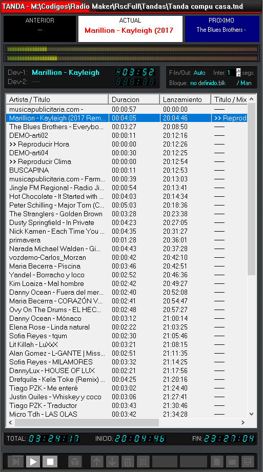
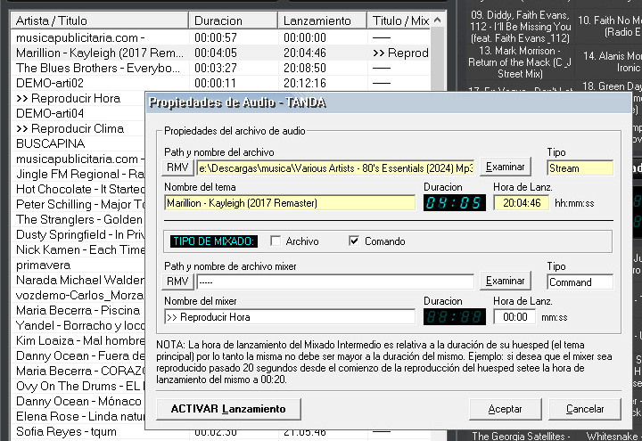
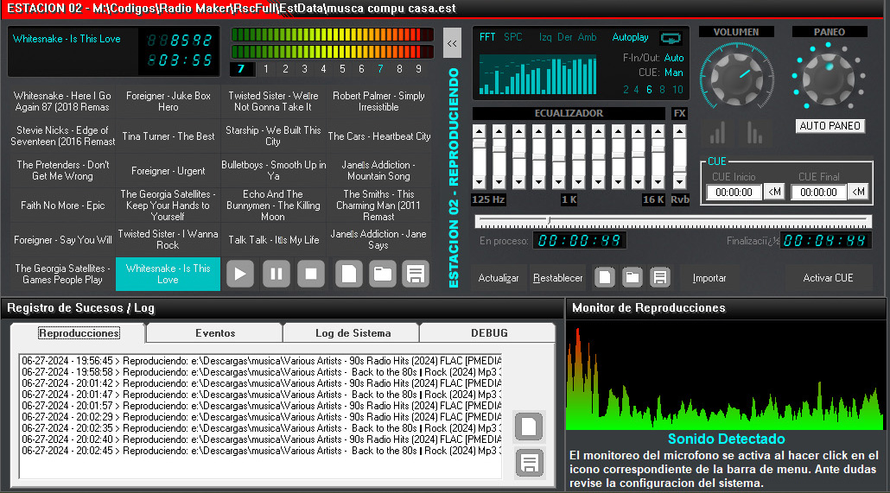
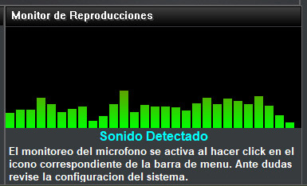
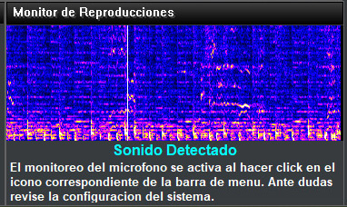
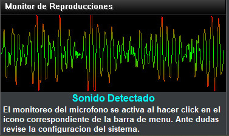
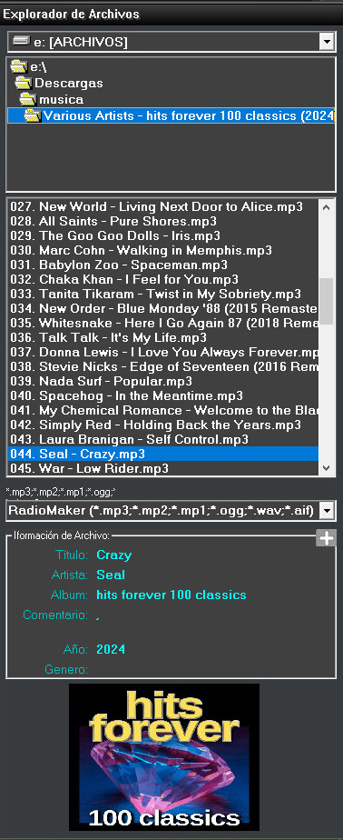
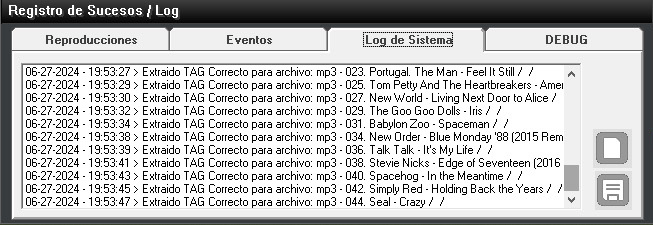

	

	

	<b>RadioMaker</b> es un Software Libre y Gratuito para La Automatización de Estaciones radiales en <b>Windows</b>.

 

	Creado para Estaciones radiales que necesiten un sistema <b>Simple</b>, <b>Estable</b>, <b>Robusto</b>, <b>y facil de usar</b> para transmitir en diversos medios.

 

	<a href="https://github.com/ChristianDelMonte/RadioMaker/releases/tag/v1.2.37-beta.1">VER INFORMACION DEL RELEASE AQUI </a> O
	<a href="https://github.com/ChristianDelMonte/RadioMaker/releases/download/v1.2.37-beta.1/OnlyRM100_Beta_Setup.exe"> DESCARGAR AQUI</a>

Compatible con Windows 7 SP2, 8.1, 10 y 11. - Actualmente en fase de desarollo BETA

	<a href="https://github.com/ChristianDelMonte/RadioMaker/README.Eng_Us.md"> English</a> | <a href="https://github.com/ChristianDelMonte/RadioMaker/README.md"> Español</a>

<a href="https://www.facebook.com/groups/onlyradiomaker">Únete a nuestro grupo en Facebook!</a>

# Contenido

- [Caracteristicas](#Caracteristicas)
- [Comencemos](#Comenzando)
- [Capturas de pantalla](#Capturas)
- [Contribuciones](#Contribuciones)
- [Donaciones](#Donaciones)
- [Recursos](#Recursos)

# Caracteristicas

* 2 Estaciones de aire (01 y 02) para reproducción instantánea al aire.
	* incluye ecualizadores, fade in y out automáticos, control de cue y mucho más.
* Analizador de espectro de alto rango en toda reproducción dentro del sistema.
* Modulo de Tanda para programar listas de reproducciones de hasta 24hs de duración cada una.
	* incluye fade in y out automáticos y programación de comandos (hora, clima y otros).
	* posibilidad de inclusión de comandos intermedios o pisadores entre la reproducción y mucho más.
* Modulo de Programación de Tandas donde prodrá programar hasta 24 tandas (previamente armadas de 24hs cada una).
* Soporta múltiples formatos de audio: wav, mp1, mp2, mp3, ogg, aif y otros como Flac a través de plugins de entrada (incluidos con el sistema).
* Incluye el Plugin RmVoice que le permitirá la emisión en cualquier momento de la Hora y el clima actual con voz.
* Modulo de programación horaria: para programar la reproducción las pautas publicitarias a emitirse en dias y horas determinadas. 
* Modulo de registro de reproducciones, logs  y sucesos del sistema que podrá exportar para guardar registro si fuese necesario.
* Explorador de archivos para trabajar simplenmente realizando drag a drop de los audios en los diferentes modulos.

# Comenzando

Puedes descargar de aqui: <a href="https://github.com/ChristianDelMonte/RadioMaker/releases/tag/v1.2.36-beta.1">la última versión</a>, descomprimir y ejecutar OnlyRM100_Beta_Setup.exe. para instalar la aplicación en su computadora. A continuación si es necesario les dejamos unos instructivos:

- <a href="https://github.com/ChristianDelMonte/RadioMaker/docs/rm100_install_es.md">Guia de Instalación y configuración de RadioMaker</a>
- <a href="https://github.com/ChristianDelMonte/RadioMaker/docs/rm100_user_manual_es.md">Manual del Usuario Final</a>

# Capturas

### Ventana principal de RadioMaker

	

### Modulo de Estaciones 1 y 2

	

### Modulo de Tanda

	

### Comandos en Tanda o Pisadores

	

### Otros Modulos

	

	

	

	

### Explorador der archivos

	

### Registro de Reproducciones y Sucesos

	

# Contribuciones

Siempre es posible contribuir con nosotros para poder brindarle a nuestra comunidad un Software digno de competir con los mejores del mercado. A pesar de que Radiomaker es totalmente libre y gratuito no es de código abierto (por el momento), y si deseas agregar tu granito de arena y ayudarnos a mejorarlo siempre estaremos agradecidos por ello y te ganarás un lugarcito en los créditos del programa.

Puedes contribuir ayudándonos con la documentación, traduciendo el sistema a diferentes idiomas, testeándolo y reportando los bugs o problemas que encuentres o simplemente comunicándote con nosotros para compartir ideas de nuevas funcionalidades que podamos agregar.

Por el momento la mejor contribución que puedes realizar es probar Radiomaker y reportar cualquier inconveniente que pueda surgir de su uso. El sistema se encuentra actualmente en fase BETA y a pesar de que funciona bien dentro de los testeos que nosotros mismos hemos realizado antes de lanzarlo, es posible, que surgan otros problemas derivados de las diferentes pruebas de usuarios.

Otra manera de contribuir con nosotros sería a manera de Sponsors. Hazle publicidad al software Radiomaker en tu radio. Díles a tus oyentes que estás usando Radiomaker (libre y gratuito para transmitir en tu radio). Da a conocer a tus oyentes el facebook y el github de Radiomaker para que se unan a la comunidad e infórmanos al respecto ya que el beneficio puede ser mutuo. Puedes enviarnos por correo electronico los datos de tu estación radial con tu logo en formato PNG y el link de tu radio online para que lo agreguemos en el software. Todas las contribuciones son bienvenidas.

Esperamos tu Apoyo!.

# Donaciones

Antes de realizar cualquier donación o contribución debemos dejar en claro algo: **En esta transacción no existe una relación vendedor/comprador**. Radiomaker no ofrece soporte o garatías de ningun tipo. Las sugerencias a nuevas funcionalidades serán siempre apreciadas pero no significa que estamos obligados a realizarlas. Los bugs encontrados e informados serán solucionados en la medida de lo posible pero deberá entender que no existirá ninguna relación de tipo desarrollador (nosotros) y usuario (Ud.).

**Radiomaker es un Software Completamente Libre y Gratuito**, no debes abonar absolutamente nada para poder usarlo por completo en todas sus funcionalidades (aunque en fase BETA el programa pueda estar restringido en ciertos aspectos).

De todas maneras sería muy bueno para nosotros que nos ayudaras con alguna donación monetaria para solventar los gastos diarios que surgen del trabajo en el mismo.

El equipo de trabajo de Radiomaker invierte mucho tiempo en el desarrollo y testeo del Software y el tiempo invertido es mejor invertido si hay una retribución de por medio que nos incentive a seguir trabajando para los Radio aficionados que lo aprecien y puedan obtener un rédito usando nuestro sistema. Cuando el rédito es mutuo se trabaja mejor.

Por favor siéntase libre de contribuir con nuestro propósito usando los siguientes links de abajo:

	<a href="https://mpago.la/2ZcfmnZ">$ARs 5mil - (5 USD)</a>  | 
	<a href="https://mpago.la/2YhvDaC">$ARs 10mil (10 USD)</a>  | 
	<a href="https://mpago.la/1ADD94t">$ARs 20mil (20 USD)</a>  | 
	<a href="https://mpago.la/2skYsPm">$ARs 50mil (50 USD)</a>

	

	<a href="https://www.paypal.com/ncp/payment/KBUUPBNN4JQVQ">$ARs 5mil - (5 USD)</a>  | 
	<a href="https://www.paypal.com/ncp/payment/PSQTX4W3KR5H4">$ARs 10mil (10 USD)</a>  | 
	<a href="https://www.paypal.com/ncp/payment/JMB6GBPCHGPVJ">$ARs 20mil (20 USD)</a>  | 
	<a href="https://www.paypal.com/ncp/payment/LZWLKP2KGBRNQ">$ARs 50mil (50 USD)</a>

LUEGO DE REALIZADA LA DONACIÓN por favor eníanos un mensaje para informar tu apoyo al siguiente correo electrónico: <a href="mailto:creadig@gmail.com">creadig@gmail.com</a> o puedes enviarnos un mensaje privado en nuestro grupo de facebook: <a href="https://www.facebook.com/groups/onlyradiomaker"> Únetenos!</a>.

**RECUERDA** que mencionamos y apoyamos a todos nuestros usuarios y donadores! por lo tanto puedes incluir (si lo deseas) en el correo antes mencionado los datos completos de tu emisora radial para que la incluyamos en los créditos de RadioMaker, ajuntá también un logotipo en formato png o jpg y un link a la emisora online (si es necesario).

# Recursos

**RadioMaker** utiliza librerías y recursos de otros usuario / colaboradores / desarrolladores que se detallan a continuación:

* [**Libreria de audio BASS DLL**] Por: Ian Luck at Un4seen Development Ltda: <a href="https://www.un4seen.com">www.un4seen.com</a>
* [**dcButton Usercontrol**] Por: Noel A. Dacara: <a href="mailto:noeldacara@hotmail.com">noeldacara@hotmail.com</a>
* [**ucKnob Usercontrol**] Por: Leandro Ascierto: <a href="https://www.leandroascierto.com">www.leandroascierto.com</a>
* [**TitelBar Usercontrol**] Por: Jörg Pfeffer alias Peppa (lamentablemente no hay mas información al respecto de este desarrollador).
* [**Rutinas de Subclasing**] Por: Paul Caton: <a href="mailto:Paul_Caton@hotmail.com">Paul_Caton@hotmail.com</a>
* [**Live Audio Spectrum Module**] Por: JOBnik! Arthur Aminov: <a href="mailto:jobnik@jobnik.org">jobnik@jobnik.org</a>

### Visual Resources

* [**Icono de Radiomaker**] Por: Delwar018 en Flaticon website: <a href="www.flaticon.com/authors/delwar018">www.flaticon.com</a>
* [**Iconos Generales de Radiomaker**] Por: Axialis Team: <a href="www.axialis.com/free/icons">www.axialis.com</a>

*- Fin del comunicado - Cambio y fuera! ----------------------------------------------------------------------------------------*

